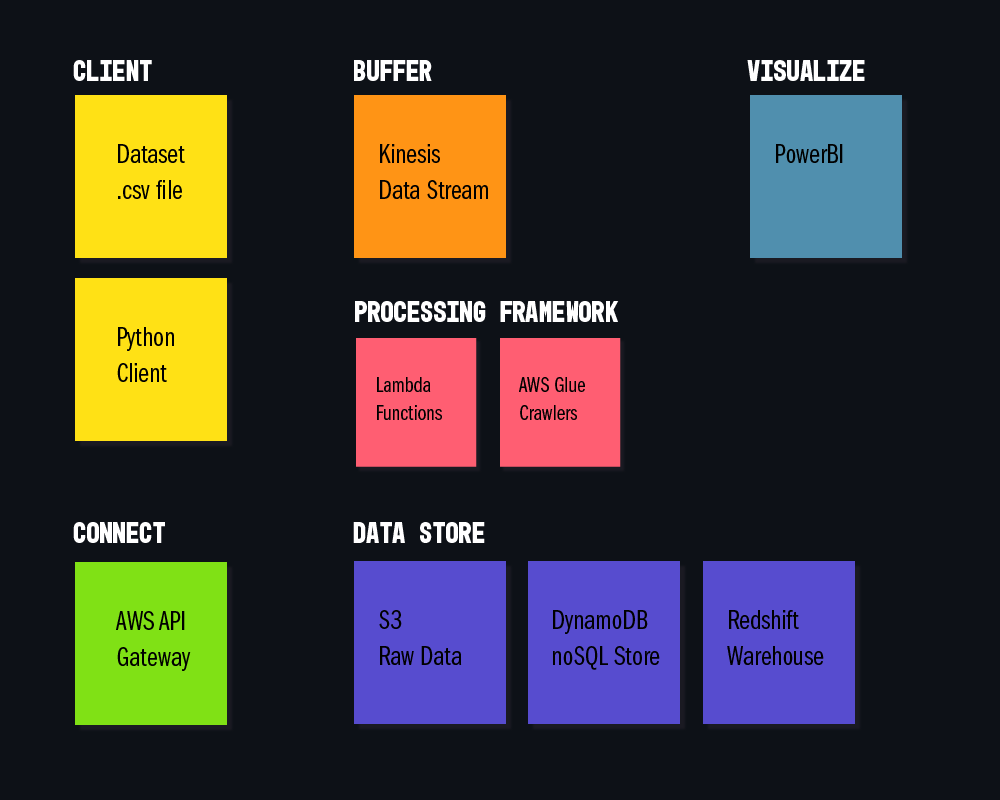
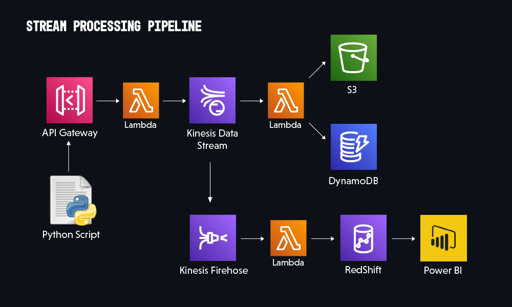
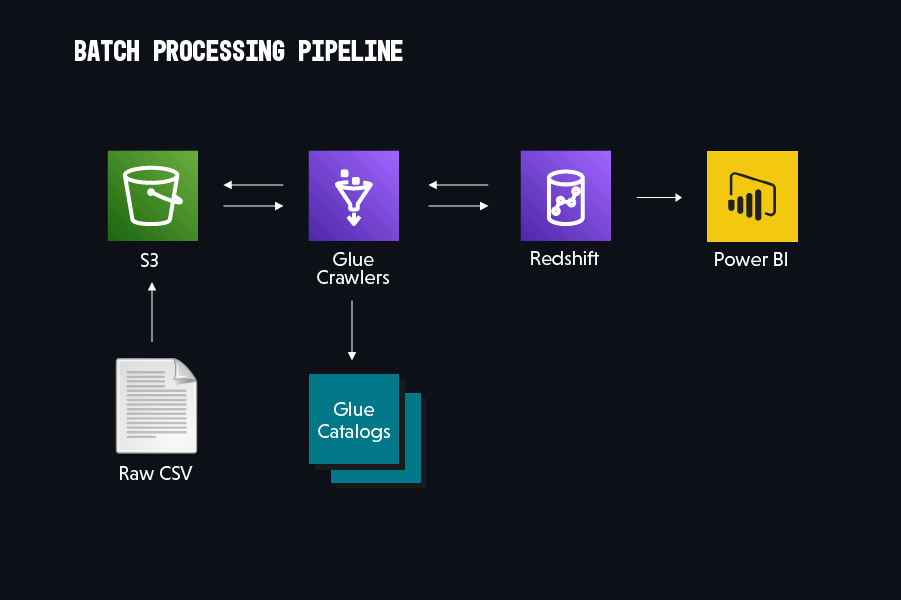
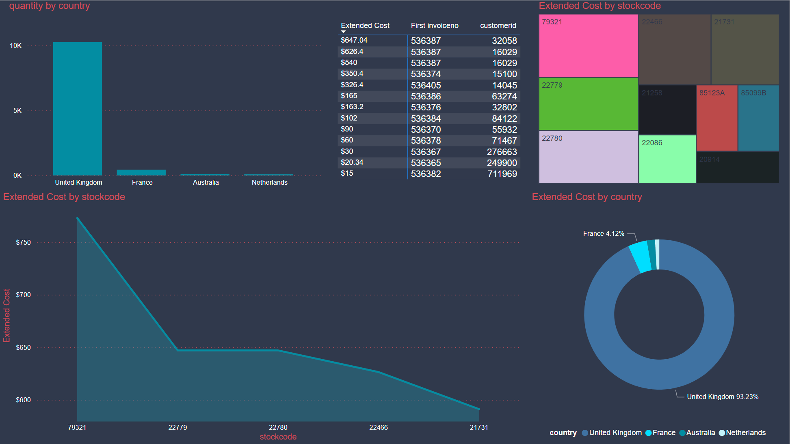

AWS Pipeline Project - Repository for project description and documentaiton along with Python scripts, Spark scripts, and SQL queries used during the creation of the pipeline and post pipeline analytics.

**Contents**

- [Introduction and Goals](#introduction-and-goals)
- [Dataset Overview](#dataset-overview)
- [Tools and Services](#tools-and-services)
  - [Connect](#connect)
  - [Buffer](#buffer)
  - [Processing](#processing)
  - [Storage](#storage)
  - [Visualization](#visualization)
- [Pipeline Breakdown](#pipeline-breakdown)
  - [Stream Processing](#stream-processing)
  - [Batch Processing](#batch-processing)
- [PowerBI Visualization](#powerbi-visualization)
- [Problems and Debugging](#problems-and-debugging)
- [Conclusion](#conclusion)

---

# Introduction and Goals
The purpose of this personal project is to establish a data pipeline for e-commerce data to be transported to a PowerBI dashboard for business analysts. There are many issues to be considered and many individual components that influence your ability to consolidate data within a company. A few of the initial considerations when beginning this project:

- Data Sources: Internal operational database for transactions, CRM platforms, CSV or other file datasets.
- Data Quality: The quality of the data being processesed directly impacts the services and tooling required to properly store and use the data for analytical purposes.
- Internal Customers: All data pipelines have the potential to services multiple end clients inside the company rather than just a single group. There may be sales teams, executive level individuals, supply chain teams, machine maintenance teams and many more who require the pipeline to provide value for them.
- Documentation: For each of the outputs that your pipeline connects to (dashboards, warehouses, data lakes, etc) all have an end use and a process that involves many source streams and transformations. All this required proper documentations and testing to ensure that the tema knows how each piece works and can quickly respond to issues that arise.

# Dataset Overview
The dataset used for this pipeline project came from a Kaggle project located [here](https://www.kaggle.com/datasets/carrie1/ecommerce-data). This information comes from a UK based retailer and represents a subset of actual transaction data from 2010 to 2011.

As this dataset is a record of transactions, it is in a "long" format meaning invoice numbers will repeat for each unique item that was on the invoice. The column headers and the datatype I will use within AWS are:

- InvoiceNo (text)
- StockCode (text)
- Description (text)
- Quantity (integer)
- InvoiceDate (text)
- UnitPrice (float)
- CustomerID (integer)
- Country (text)

Many of the fields will end up becoming text fields, including the invoice number which has instances of a "C" prefix so we cannot store this column as an integer.

Looking ahead to how an analyst might be viewing this information, it is important to consider the exisitng fields as well as potential calculated fields that would be important to have. In this case having a total calculated cost for each line would be useful for invoice value aggreagations as well as determining highest revenue products.

# Tools and Services
For this project I will be focused on using Python as the scripting language for both the front end data streaming as well as the AWS Lambda functions within the pipeline.

The AWS services used in this project include:
- API Gateway
- Kinesis / Kinesis Firehose
- S3
- DynamoDB
- Redshift
- Glue

Secondary software used:
- VS Code
- Excel
- PowerBI

## Connect
We will be using AWS's API Gateway service to provide our Python script access to standard functionalities such as `GET`, `PUT`, and `PUSH` calls to our pipeline. 

## Buffer
Kinesis data stream will act as our buffer for incoming PUT calls via a Lambda event trigger which will write the data into Kinesis for further processing.

Additionally, we'll be using Kinesis Firehose to as a delivery stream to our Redshift data warehouse to supply the data for our analytics dashboard.

## Processing
Throughout the pipeline we will make use of Lambda functions in combination with event triggers to process data and move it along to the next stage of the pipeline. This provides modularity in our scripting and helps with testing individual components of the pipeline as it is setup or as problems arise for edge cases.

## Storage
We'll be making use of several data store solutions within AWS. First is S3 which will act as our raw data store. Second is DynamoDB which will be our noSQL store utilizing the wide column framework. Last is Redshift which will be the data warehouse supporting the analytics channel and provide the data for our dashboard tool.

## Visualization
The tool we will use to power our visuals on the backend of this pipeline is PowerBI  which wil connect to our Redshift warehouse and allow business users to create dashboards and monitor select KPI's.

# Pipeline Breakdown

Visualizing the tools used for this project is easier when you group them into their individual containers. Typically a pipeline will consist of similar stages with just the tools themselves being swapped out for what makes sense or is currently used at a company.

## Stream Processing

For the stream processing pipeline I needed to setup a Python script that would mimic incoming transaction data as though it we being fed by multiple operational databases. This would simulate the situation of having multiple retail locations all processing their own invoices and streaming that data out of the OLTP data warehouse into our data pipeline and into a OLAP data warehouse.

The main features of this stream pipeline:

- Use of Lambda functions to direct the flow of data through Kinesis into both an S3 bucket for raw storage and into DynamoDB which has wide column stores setup for API queries.
- Contained pathways for operational data use in DynamoDB for invoice/customer queries and analytics use sending a copy of the data through Firehose into RedShift for Power BI.

## Batch Processing

Contrary to the stream processing, our batch processing pipeline will mimic a workflow that involves bulk data dumps which may occur hourly, daily, etc. This process differs from the stream pipeline in a few key ways:

- Not a continuous stream of data which requires a strong buffer system to manage triggers
- Makes use of AWS Glue Crawlers to tracking new data files stored in an S3 bucket and executes a Spark Glue Job which transfers the data into a RedShift Table

# PowerBI Visualization

For our analytics team we need a tool that can plug into our Redshift data warehouse and allow users to create dashboards and monitor KPI's, for this we used Microsoft's PowerBI tool. As I did not load all of the available data due to cost restrictions, analysis of the dataset would not be the focus of this project.

The benefit to having this separate data warehouse to the operational warehouse is to remove the processing workload from impacting the business transactions. With the live query option in Power BI we are able to maintain access to updated information and build out dashboards as required by the business units.

# Problems and Debugging

Through any pipeline building process there will be issues that arise and problems to debug. I wanted to highlight a few things about debugging within the AWS platform and hopefully if you have issues you can use these tips to identify and resolve them.

1. CloudWatch logging: AWS provides automated logs for just about all the services you setup and dumps them into their own folder within the CloudWatch service page. Be sure to check out  your service configuration or monitoring section to enable this.
2. Local testing: When creating Lambda functions it is something difficult or tedious to continuously adjust and deploy changes and wait for the outcome in other services. You can recreate smaller pieces of the Lambda that you can iterate on locally prior to pushing them to live.
3. Test one service at a time: I would strongly advise against setting up all the services you will require at the start and only work the incremental steps needed to ensure that each piece of the pipeline is effective on their own and can be test modularly.

# Conclusion

One of the key takeaways I had throughout this process is that building a data pipeline will require extensive debugging, and to make resolving issues much less headache inducing you should make heavy use of CloudWatch logs. 

Through a combination of manual print statements in Lambda functions alongside CloudWatch, I was able to easily see the flow of data and the actions being taken which in turn sped up the debugging process and also helped me to understand what exactly is happening behind the scenes as my data flows into the various services.

This project has taught me a lot about how data pipelines work and the many considerations one needs to have when selecting the tools and solutions to implement as there is a lot of up front work that will have to be done in order to have a proper pipeline that works specifically for your needs.